# 项目简介

仿慕课在线教育平台，该平台分为前台用户系统和后台运营平台。

- 后端接口代码请参考：https://github.com/LelandYan/online-learning/tree/mater/gui_parent
- 后台管理UI请参考：https://github.com/LelandYan/online-learning/tree/mater/vue-admin
- 前台UI请参考：https://github.com/LelandYan/online-learning/tree/mater/vue-front-1010

# 一、功能简介

该项目基于微服务技术架构，前后端分离开发。后端的主要技术架构是：Spring Boot + Spring Cloud + MyBatis-Plus + HttpClient + MySQL + Maven + EasyExcel + Nginx。前端的架构是：Node.js + Vue.js + Element-UI + Nuxt.js + ECharts。其他涉及到的中间件包括Redis、阿里云OSS、阿里云视频点播以及阿里云短信服务。业务中使用了ECharts做图表展示，使用EasyExcel完成分类批量添加、注册分布式单点登录使用了JWT。


前台系统包括：用户登录、注册、名师列表、名师详情、课程列表、课程详细、视频在线播放等模块。


后台管理系统包括：首页、权限管理、讲师分类、课程分类、课程管理、统计分析等模块。

# 二、系统模块功能简介
 - guli-parent，由十个微服务组成
   - api-gateway:统一路由处理，通过整合spring cloud gateway组件来实现统一的接口调用
   - service-edu:核心的业务模块，需要通过远程调用其他模块来实现自身的业务。
   - service-oss:阿里云OSS,通过与阿里云OSS整合实现一个文件系统存储系统中文件上传。
   - service-vod:阿里云Vod，视频点播系统，通过本地系统调用阿里云vod的SDK来实现视频的上传与在线播放
   - service-cms:后台运营平台通过此模块的功能，可以实现控制前台用户系统的首页内容。
   - service-sms:短信服务，变成QQ邮箱发送验证码（由于阿里云的签名申请和模板申请未成功，短信接口未测试）。
   - service-ucenter:前台用户系统的用户中心模块。功能包括登录，注册等，登录已实现通过微信扫码自动登录，（qq登录还未测试）。
   - service-trade:订单微服务，功能包括订单的增删查，整合了微信端的支付功能（但是还未测试，使用模拟接口进行调试）。
   - service-statistics:统计模块，前端整合Echarts来实现简单的一个折线图统计。
   - service-acl:权限管理模块，整合Spring secruity实现用户管理，角色管理，以及菜单管理。用户根据角色来获取对应的菜单。
 - vue-admin:
   - 前端运营管理模块，基础框架由 [vue-admin-template](https://github.com/PanJiaChen/vue-admin-template)搭建
 - vue-front-1010；
   - 前台用户系统，使用 [nuxt.js](https://www.nuxtjs.cn/)快速搭建

# 三、环境部署

### 准备工作

IDEA，Visual Studio Code，JDK >= 1.8 (推荐1.8版本)， Mysql >= 8.0， Maven

### 运行系统

1、使用Git命令克隆 git clone https://github.com/LelandYan/online-learning.git

2、导入到IDEA，IDEA会自动加载Maven 依赖包，初次加载会比较慢（根据自身网络情况而定） 

3、创建数据库并导入数据脚本resources/data.sql  

4、修改各个模块的application.properties文件的MySQL配置信息

```sql
# mysql数据库连接
spring.datasource.driver-class-name=com.mysql.cj.jdbc.Driver
spring.datasource.url=jdbc:mysql://localhost:3306/你的数据库名称?characterEncoding=utf-8&useSSL=false&serverTimezone=UTC
spring.datasource.username=root
spring.datasource.password=你的数据库密码
```


5、将resources文件夹下的nginx.conf复制到自己安装目录下，nginx.bat启动Nginx

6、启动后台管理UI

7、启动前台Web UI


# 效果图

<table>
    <tr>
        <td>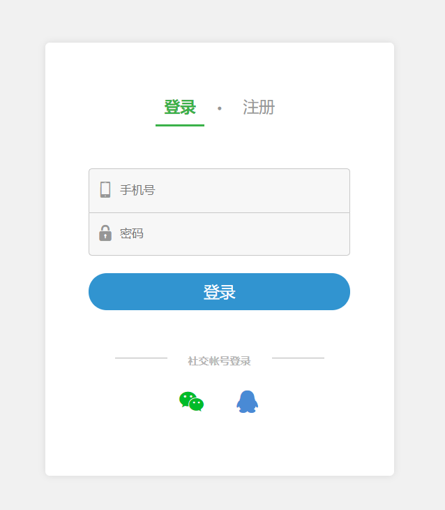</td>
        <td>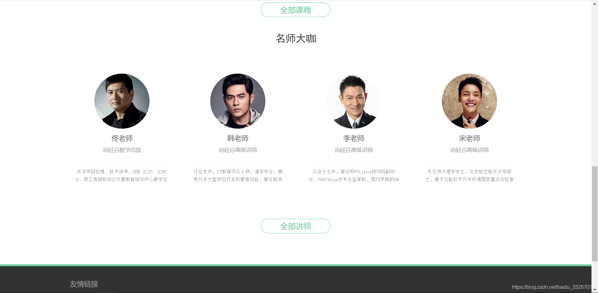</td>
    </tr> 
    <tr>
        <td>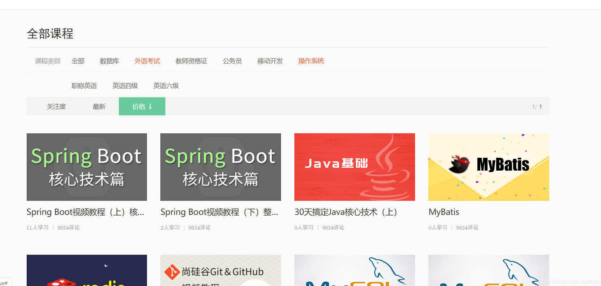</td>
        <td></td>
    </tr>  
    <tr>
        <td></td>
        <td>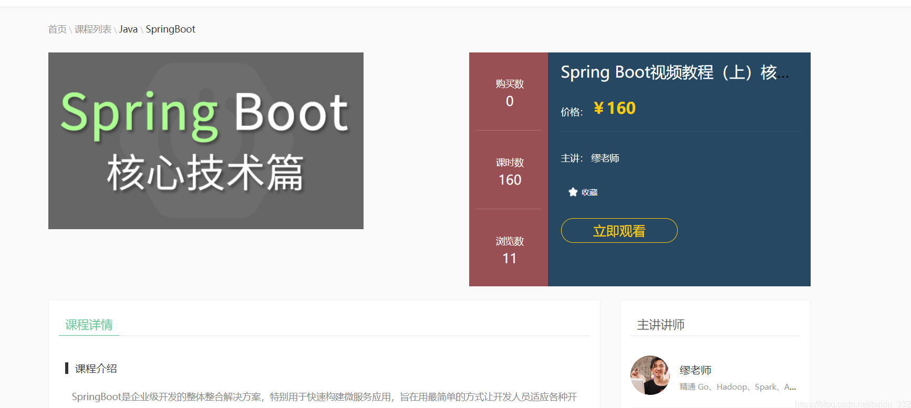</td>
    </tr>  
    <tr>
        <td>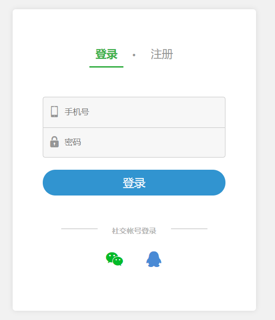</td>
        <td>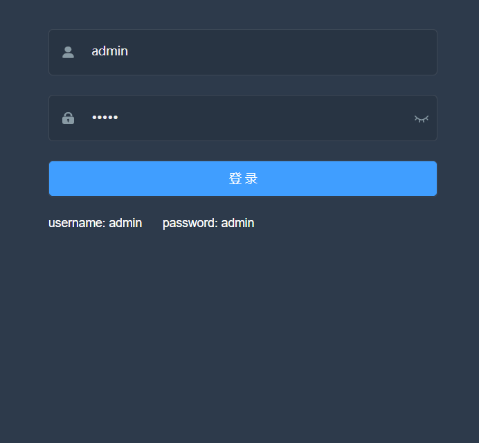</td>
    </tr>  
    <tr>
        <td>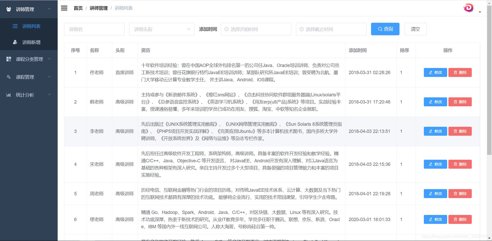</td>
        <td>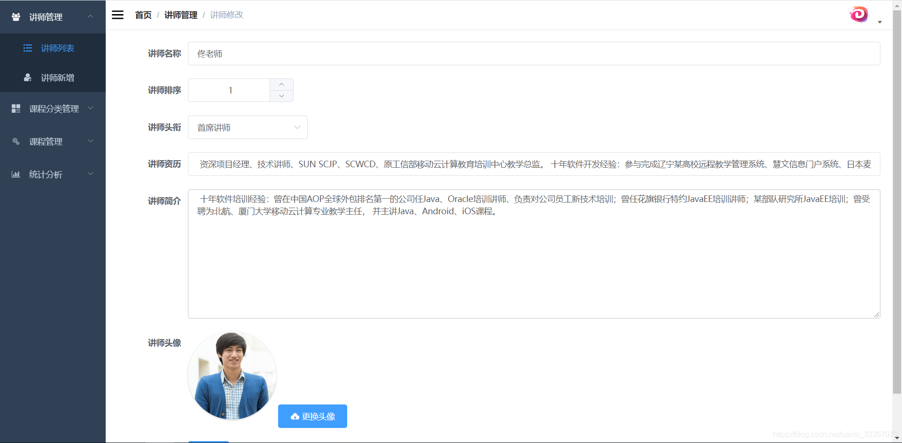</td>
    </tr>  
    <tr>
        <td>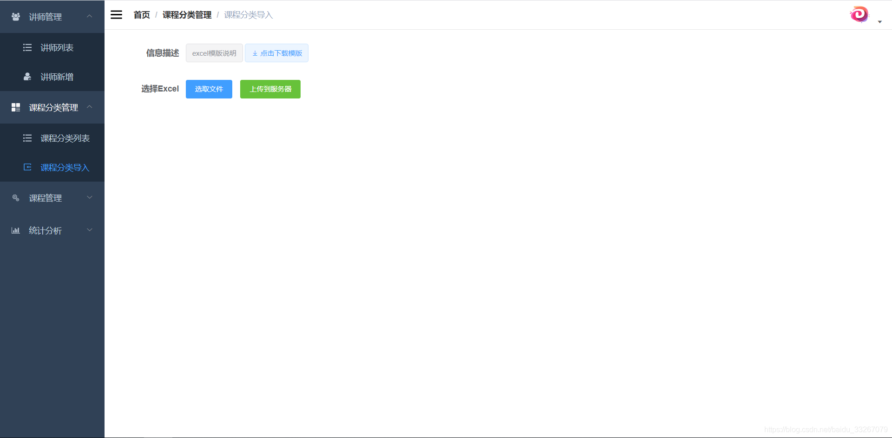</td>
        <td>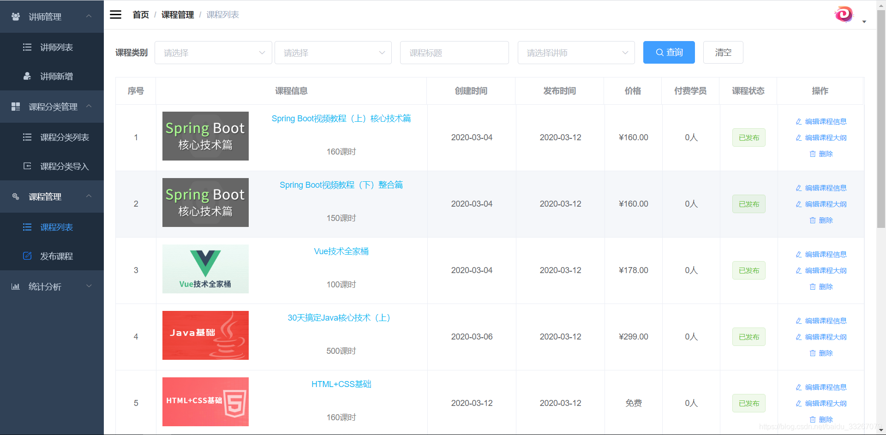</td>
    </tr>  
    <tr>
        <td>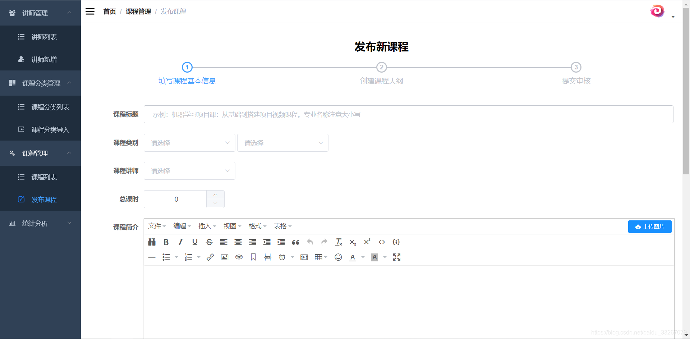</td>
        <td>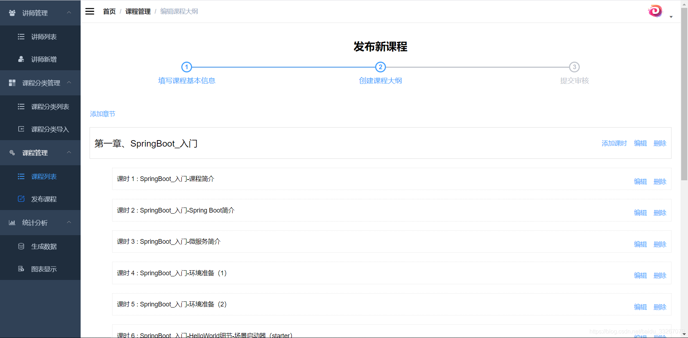</td>
    </tr>  
    <tr>
        <td>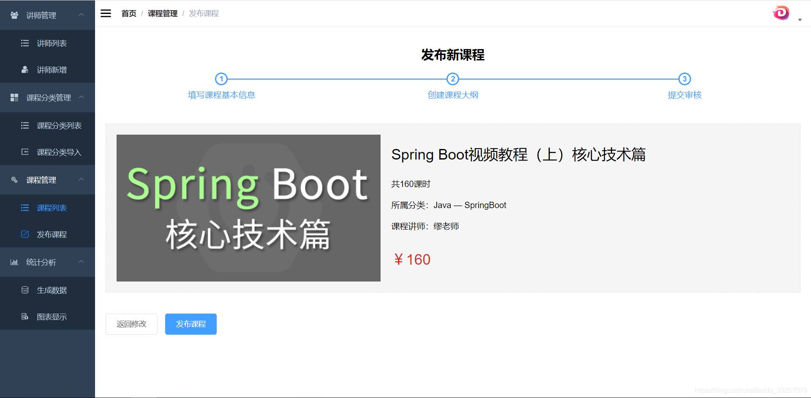</td>
        <td>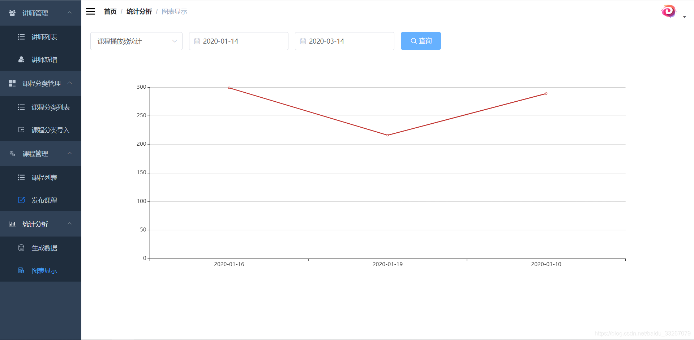</td>
    </tr> 
</table>
